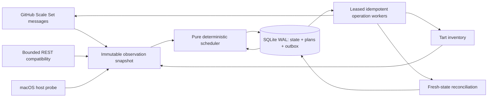

# Tart Runner Fleet

Private, fail-closed control plane for dynamically scheduling ephemeral GitHub
Actions runners on a single Apple Silicon host using Tart.

The current shell manager remains production authority while this daemon moves
through observe, shadow, canary, and controlled cutover phases.

## Operator experience

`fleetctl` is the stable interface for humans and automation. It communicates
with `fleetd` through a private `0600` Unix socket, receives a coherent daemon
snapshot, and never reads or mutates SQLite directly.

```sh
# One-screen operational summary
fleetctl status

# Stable, versioned output for agents and scripts
fleetctl status --output json

# Focused views
fleetctl queues
fleetctl instances
fleetctl operations
fleetctl observations

# Fast and deep checks
fleetctl health
fleetctl doctor

# Prometheus exposition for local diagnostics
fleetctl metrics
```

Every network operation has a bounded deadline. Output data goes to stdout,
diagnostics go to stderr, rows are deterministically ordered, and exit codes
are stable. Mutation commands are intentionally absent while the controller is
restricted to observe/shadow mode.

Run `fleetctl help` for the concise command contract or see
[`docs/CLI.md`](docs/CLI.md) and [`docs/API.md`](docs/API.md).

## Five-minute local start

```sh
cp config/fleet.example.json fleet.json
fleetctl config validate fleet.json
fleetd run --mode observe --config fleet.json --database fleet.db
```

In another terminal:

```sh
fleetctl status
fleetctl doctor
```

The default socket is
`$HOME/Library/Caches/tart-runner-fleet/fleetd.sock` on macOS. Pass the same
explicit location to both programs when desired:

```sh
fleetd run --admin-socket /absolute/private/path/fleetd.sock ...
fleetctl status --endpoint unix:///absolute/private/path/fleetd.sock
```

## Architecture



The design follows ports and adapters rather than a class hierarchy. Domain
values and state transitions are explicit; scheduler functions are pure;
GitHub, SQLite, Tart, clocks, randomness, and host probes are replaceable ports.
This keeps policy testable and prevents backend mechanics from leaking into
fairness or safety decisions.

## Engineering contract

- deterministic functional scheduling core;
- durable SQLite WAL state and idempotent operation outbox;
- official GitHub Actions Scale Set protocol for demand and JIT registration;
- explicit host-mode and instance state machines;
- fail closed when GitHub, Tart, or host observations are stale/unavailable;
- no Linux/macOS overlap beyond configured, proven resource envelopes;
- aged global FIFO with fair, capacity-aware backfill;
- ephemeral runners and two-phase drain before deletion;
- secrets never persisted or emitted;
- race detector, replay/contract/chaos tests, and at least 99% statement coverage.

## Local development

```sh
make verify
```

The repository requires Go 1.25.12. Production deployment is deliberately
disabled until shadow-mode decisions match the incumbent manager and all canary
gates pass.

Useful focused loops:

```sh
go test -race ./cmd/fleetctl ./internal/adminapi ./internal/telemetry
go test -fuzz=Fuzz -fuzztime=30s ./internal/scheduler
./scripts/check-coverage.sh 99.0
```

The blocking CI pipeline is intentionally layered and uses only dynamically
provisioned self-hosted Linux runners:

- small preflight: module integrity, formatting, actionlint, SHA pinning;
- medium quality: vet, golangci-lint with gosec, CPD, official deadcode,
  govulncheck;
- medium unit/coverage and large race jobs run concurrently;
- a small required build gate produces verified macOS ARM64 binaries.

`Required CI` fails closed for unsuccessful upstream gates but does not survive
workflow cancellation, so a superseded commit cannot retain the concurrency
group and starve its successor.

All Go analysis tools are pinned through Go 1.25 tool directives, every action
uses an immutable commit SHA, and Go 1.25.12 is the minimum toolchain because it
contains the required standard-library vulnerability fixes. Nightly CI repeats
replay/contract/integration/chaos tests and fuzzes the deterministic scheduler.
Tagged releases rebuild each macOS ARM64 binary twice, compare both binaries and
their CycloneDX 1.6 SBOMs byte-for-byte, and publish SHA-256 manifests.

The controller is itself a permanent fleet target. Its three parallel CI jobs
exactly fill the Linux envelope, while the installed release or pinned incumbent
remains authority long enough to build and verify its successor. CI tests this
self-hosting capacity invariant on every change; upgrades never replace the
running controller before the successor has completed Required CI. See the
two-generation bootstrap procedure in [`docs/OPERATIONS.md`](docs/OPERATIONS.md).

## Documentation

- [`docs/CLI.md`](docs/CLI.md) — operator commands, output, and exit codes
- [`docs/API.md`](docs/API.md) — local API compatibility and security contract
- [`docs/OPERATIONS.md`](docs/OPERATIONS.md) — deployment and rollout
- [`docs/SECURITY.md`](docs/SECURITY.md) — threat model and secret handling
- [`docs/TESTING.md`](docs/TESTING.md) — TDD and verification layers
- [`AGENTS.md`](AGENTS.md) — mandatory workflow for coding agents

## Promotion gates

- **Observe:** ingest and persist facts; emit no mutations.
- **Shadow:** compute plans and compare them with incumbent decisions.
- **Canary:** own one dedicated scale set/profile with bounded capacity.
- **Authority:** take all configured profiles after a zero-overlap handoff.
- **Rollback:** stop admission, drain owned instances, atomically reactivate the
  pinned incumbent release.

The checked-in daemon currently enforces an observe/shadow ceiling. See
[`docs/OPERATIONS.md`](docs/OPERATIONS.md) for configuration and rollout.
