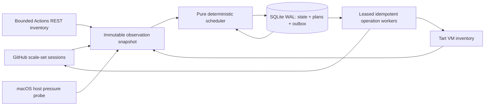

# Tart Runner Fleet

Tart Runner Fleet turns a single Apple-silicon Mac into a self-hosted GitHub
Actions runner pool. One daemon subscribes to GitHub Actions **runner scale
sets**, clones an immutable [Tart](https://tart.run/) VM per queued job,
registers a just-in-time **ephemeral** runner inside it, and destroys the VM
when that one job finishes. Admission is bounded twice — by exact CPU/memory/slot
vectors *and* by a live host probe (free disk, reclaimable memory, swap, CPU
idle, load) — so the machine never overcommits and can remain someone's daily
driver. It exists for teams that need real macOS and Linux CI capacity on
hardware they own, without a long-lived runner accumulating state or
credentials. All state is durable SQLite; all operator access goes through one
`fleet` binary over a private `0600` Unix socket; secrets are never logged or
persisted.

macOS on Apple silicon only. Licensed under [AGPL-3.0](LICENSE); commercial
licenses are available — contact the owner. Contributions require signing the
[CLA](CLA.md).

## How it works



- **One authority.** Exactly one daemon holds a renewable singleton lease and
  stops on lease loss. Modes escalate `observe` → `shadow` → `canary` →
  `authority`; promotion is always an explicit operator action.
- **Durable state, no hidden queues.** SQLite WAL holds instances, demand,
  plans, and an operation outbox. External effects are leased, idempotent, and
  retried with bounded backoff, so a restart resumes state instead of guessing
  from process presence ([ADR 0003](docs/adr/0003-sqlite-outbox.md)).
- **Demand comes from GitHub, and fails closed.** Official scale-set message
  sessions supply queued jobs; a bounded REST inventory supplies canonical job
  truth. A stale or unavailable observation never decodes as "no work"
  ([ADR 0002](docs/adr/0002-official-scale-set-protocol.md)).
- **One ephemeral VM per job.** plan → clone → boot → JIT register → assign →
  drain → deregister → stop → delete, driven by a single state machine per
  instance. An in-guest helper powers the VM off when the one-shot listener
  exits ([ADR 0010](docs/adr/0010-ephemeral-guest-shutdown.md)).
- **Admission is exact and pressure-aware.** Profile vectors, repository caps,
  and profile `maxActive` first; then a fresh host probe that defers on disk,
  memory, swap, or CPU pressure. Linux and macOS share one envelope by default
  ([ADR 0012](docs/adr/0012-shared-cross-platform-capacity.md)).
- **No instance holds the host forever.** A profile states a wall-clock ceiling
  on how long one of its instances may hold its resource vector; a hold past it
  is reclaimed through the ordinary graceful drain, and a hold approaching it is
  a warning, a metric, and a `fleet doctor` finding first
  ([ADR 0036](docs/adr/0036-an-instance-may-not-hold-its-vector-forever.md)).
- **Scheduling is fair by construction.** Young work is ordered by dominant
  resource share and packed for maximum cardinality; aging promotes old work to
  global FIFO so a large job cannot starve; a `control-plane` target gets one
  bounded quantum ahead of *young* standard work
  ([ADR 0004](docs/adr/0004-bounded-control-plane-priority.md)).

## Quickstart

Prerequisites: Apple-silicon macOS with Tart at `/opt/homebrew/bin/tart`; an
authenticated `gh`; a GitHub App installed on every served repo/org; immutable
Linux and macOS Tart bases containing `$HOME/actions-runner/run.sh` and the
released `tart-runner-fleet-bootstrap` helper at
`/usr/local/libexec/tart-runner-fleet-bootstrap`. Run as an unprivileged
logged-in user — never `sudo`.

```sh
REPOSITORY=vitalyiegorov/tart-runner-fleet
VERSION=$(gh release view --repo "$REPOSITORY" --json tagName --jq .tagName)
ROOT="$HOME/Library/Application Support/tart-runner-fleet"
STATE_DIR="$ROOT/state"
RELEASE_DIR="$ROOT/releases/$VERSION"
```

1. **Install a verified release.** Download the release assets, `shasum -a 256
   -c SHA256SUMS`, extract into `$RELEASE_DIR`, and run `"$RELEASE_DIR/fleet"
   version`. Full sequence, including launchd rendering and the reboot proof:
   [`INSTALL.md`](INSTALL.md). On a Linux node, [`INSTALL-linux.md`](INSTALL-linux.md).
2. **Configure.** `install -m 0600 config/fleet.example.json
   "$STATE_DIR/fleet.json"`, add the scoped `github` block, then
   `"$RELEASE_DIR/fleet" config validate "$STATE_DIR/fleet.json"`.
3. **Provision scale sets — plan first, then apply.**

   ```sh
   "$RELEASE_DIR/fleet" scale-sets provision --config "$STATE_DIR/fleet.json"
   "$RELEASE_DIR/fleet" scale-sets provision --config "$STATE_DIR/fleet.json" \
     --apply --write --confirm provision-scale-sets --reason "initial rollout"
   ```

4. **Verify.**

   ```sh
   FLEET="$ROOT/current/fleet"
   "$FLEET" status
   "$FLEET" doctor
   "$FLEET" status --require-ready -o json
   ```

Try the binary without touching a real fleet (observe mode reads nothing it can
mutate; it reports `NOT READY` against the unmodified example config because no
GitHub scope is configured):

```sh
go build -o bin/fleet ./cmd/fleet
cp config/fleet.example.json fleet.json
./bin/fleet config validate fleet.json
./bin/fleet run --mode observe --config fleet.json --database fleet.db \
  --admin-socket "$PWD/run/fleetd.sock" --health-address 127.0.0.1:9877
# in another terminal
./bin/fleet status --endpoint "unix://$PWD/run/fleetd.sock"
```

## CLI at a glance

`fleet help` prints the authoritative contract. Read-only commands are always
safe: they take a coherent snapshot over the admin socket and never open SQLite.

| Read-only command | Purpose |
| --- | --- |
| `fleet status [--require-ready]` | Controller, host pressure, queues, instances, observations, operations |
| `fleet queues` | Queued jobs and oldest age, per profile, per scope, and per priority tier |
| `fleet instances` | Live VM count, vCPU, and memory by profile |
| `fleet operations` | Retrying and dead durable operations, plus each parked dead letter |
| `fleet observations` | Freshness and age of every scheduler observation |
| `fleet health` / `fleet doctor` | Liveness+readiness probes / deterministic API, live, ready, metrics checks |
| `fleet metrics` | Raw Prometheus exposition |
| `fleet config validate PATH` | Decode and validate a config without starting the daemon |
| `fleet version` / `fleet api-version` | Build version / machine API compatibility (`fleet.v1`) |

Common flags: `--endpoint unix:///absolute/path/fleetd.sock` (default is the
private state directory), `--timeout 5s` (max 30s), `--output table|json` (`-o`).

**Guarded commands** mutate GitHub, the installed generation, or durable rows.
Each requires an exact `--confirm` token — a typo is a refusal, not a prompt —
and the two operator mutations also require a non-empty `--reason` recorded with
the action. Mutations are refused unless the daemon runs in `authority` mode.

```sh
# create/reconcile scale sets (plan-only without --apply --write)
fleet scale-sets provision --config PATH --apply --write \
  --confirm provision-scale-sets --reason "operator reason"

# close one dead-lettered cleanup that can never complete
fleet operations discharge --operation op-ID --instance trf-ID \
  --confirm discharge-dead-letter --reason "operator reason"

# adopt the running generation / apply the latest forward-only release
fleet update adopt --release-dir /absolute/release --mode authority \
  --confirm adopt-current-generation
fleet update apply-latest --mode authority --confirm automatic-release-update
```

Exit codes: `0` success, `1` local failure, `2` usage, `3` not found, `4` daemon
unavailable, `5` degraded/not ready, `6` unsafe precondition (every guarded
refusal). **Exit 4 and 5 are evidence, never permission** to assume zero demand
or delete VMs.

## Real-world examples

These repositories run their entire CI on one Mac mini through this fleet:
`vitalyiegorov/tart-runner-fleet` (self-hosting), `vitalyiegorov/suuudokuuu`,
`vitalyiegorov/knee-doctor`, `vitalyiegorov/hotel-provence`, and the
`budgie-at` organization. Consumers only ever write `runs-on` labels; the fleet
maps each label set to a bounded profile.

A runner label states the shape it delivers: `trf-<os>-<arch>-<cpu>x<ramGiB>`.
The label is derived from the profile's configured vector, so it cannot drift
from the VM you actually get, and adding a shape needs no new adjective
([ADR 0032](docs/adr/0032-resource-explicit-runner-labels.md)). Labels carry no
priority — the scheduler reads the vector, never the name.

| Canonical label | Shape | Alias (still routes) |
| --- | --- | --- |
| `trf-linux-arm64-1x2` | 1 vCPU / 2 GiB | `linux-small` |
| `trf-linux-arm64-2x4` | 2 vCPU / 4 GiB | `linux-medium` |
| `trf-linux-arm64-2x8` | 2 vCPU / 8 GiB — memory-bound work | — |
| `trf-linux-arm64-4x8` | 4 vCPU / 8 GiB | `linux-large` |
| `trf-linux-arm64-6x12` | 6 vCPU / 12 GiB | `linux-xl` |
| `trf-linux-arm64-8x16` | 8 vCPU / 16 GiB — takes the Linux envelope alone | — |
| `trf-macos-arm64-6x12` | 6 vCPU / 12 GiB, `maxActive: 1` | `macos-builder` |
| `trf-macos-arm64-4x7` | 4 vCPU / 7 GiB, `maxActive: 2` | `macos-maestro` |

Profiles are configuration, not built-ins:
[`config/fleet.example.json`](config/fleet.example.json) ships this matrix, and
each scope exposes only the variants it wants. Every scale set also advertises
`self-hosted` plus whatever grouping labels the operator adds
(`linux-tiered`, `macOS`, `ARM64`, `linux-ci`, …).

On a machine the fleet does not own outright, `hostBudget` caps this node's
**total** admission envelope — every platform charged against it together —
below physical capacity:

```json
"hostBudget": { "cpu": 4, "memoryMb": 10240 }
```

Omit it and the envelope stays the physical machine, which is today's behavior;
removing it is the whole rollback. It composes with the host-pressure guardrails
rather than replacing them: the guardrails narrow admission as a co-tenant gets
busy, and the budget is the ceiling that holds while the co-tenant is quiet.
`fleet config validate` rejects a budget no exposed profile could ever fit, and
a budget larger than the machine is refused at the host probe. See
[Capping a node below its hardware](USAGE.md#capping-a-node-below-its-hardware-hostbudget).

When one class of work has to outrank another -- a store release ahead of a pull
request's E2E build -- declare it once instead of cancelling queued runs by hand:

```json
"priority": {
  "escalateAfterSeconds": 1800,
  "tiers": [
    { "name": "release",
      "match": [ { "workflowRef": "*/.github/workflows/release*.yml@*" } ] }
  ]
}
```

Tiers are ordered highest first and are matched against the repository,
workflow ref, and job name the scale-set message already carries; anything
unmatched lands in the default tier. `escalateAfterSeconds` is mandatory and is
the bound: a waiting demand climbs one tier per threshold, so a declared tier
costs everything below it at most rank x threshold of extra waiting and can
never starve it. Aging still comes first, nothing is preempted, and `fleet
queues` names the tier each waiting demand landed in. Omit the block and the
fleet plans the aged FIFO it always did. See
[ADR 0037](docs/adr/0037-a-declared-tier-orders-a-band-escalation-bounds-it.md).

```yaml
# Xcode / Gradle release builds: heaviest single job, so it takes the whole
# macOS builder and runs alone (maxActive 1).
jobs:
  build-ios-e2e-app:
    runs-on: [self-hosted, macOS, ARM64, trf-macos-arm64-6x12]

# Maestro UI tests need a real macOS GUI VM with a booted simulator, and two
# fit side by side — so shards map 1:1 onto that profile's two slots.
  e2e-ios:
    runs-on: [self-hosted, macOS, ARM64, trf-macos-arm64-4x7]
    strategy: { fail-fast: false, max-parallel: 2, matrix: { shard: [1, 2] } }

# Android E2E: a privileged Redroid container claims 4 CPU / 6 GiB, so one 6x12
# VM beats two 2x4s — Android cannot usefully shard on this host.
  e2e-android:
    runs-on: [self-hosted, linux-tiered, trf-linux-arm64-6x12]
```

Pick the shape by job weight, not by habit: lint/typecheck and script-only jobs
on `trf-linux-arm64-1x2`, test and quality gates on a Linux medium runner
(`trf-linux-arm64-2x4`), bundlers and compiles on `trf-linux-arm64-4x8`, and
memory-bound single-threaded tooling on `trf-linux-arm64-2x8` rather than paying
for cores it will not use. This repository's own CI does exactly that — preflight
on 1×2, lint/coverage/build on 2×4, the race suite on 4×8 — and `knee-doctor`
splits its PR pipeline the same way. `budgie-at` additionally attaches
`linux-ci` and `linux-burst` to its 4×8 set so existing workflow labels keep
routing unchanged. Smaller vectors are admitted first and packed for maximum
cardinality, so right-sizing jobs directly raises host throughput.

## Operating it

Everything lives under `$ROOT = ~/Library/Application Support/tart-runner-fleet`:

| Path | What it is |
| --- | --- |
| `releases/<version>/` | Immutable generations; launchd always executes an exact versioned path |
| `current` | Atomic convenience symlink to the committed generation (safe for humans and agents) |
| `state/fleet.json` | Live configuration |
| `state/fleet.db{,-wal,-shm}` | Durable state — **never** open or edit by hand |
| `state/fleetd.sock` | `0600` admin socket; default `--endpoint` |
| `state/installed-generation.json` | Committed generation identity; cross-check against `current` |
| `state/fleet-authority.stderr.log` | Daemon diagnostics |
| `state/update.{stdout,stderr}.log` | Updater diagnostics |

LaunchAgents: `com.vitalyiegorov.tart-runner-fleet.authority` (the daemon,
`RunAtLoad` + restart-on-failure, installed from
`~/Library/LaunchAgents/com.vitalyiegorov.tart-runner-fleet.plist`),
`com.vitalyiegorov.tart-runner-fleet.updater` (a one-shot with a 300-second
`StartInterval`), and the short-lived `...updater-handoff`. The updater being
`not running` between ticks is healthy.

**Auto-update** is forward-only and quiescence-gated: every five minutes the
updater checks the latest normal production release, verifies checksums and
artifacts, validates the existing config against the candidate, and **defers
while any queue, VM, retry, or dead operation exists**. It then swaps plists
atomically, requires the exact new version and same mode to become ready, and
rolls back otherwise ([ADR 0011](docs/adr/0011-atomic-production-updates.md)).
`production generation is current` and a busy-fleet refusal are both successes.

**Reading `fleet status`:** `READY` means ready and inside the queue SLO;
`DEGRADED` means ready but the queue SLO is breached (the `queue SLO:` line
names why); `NOT READY` means readiness failed (the `blocked:` line names why,
e.g. `critical_observation_unavailable`). Health is also on
`127.0.0.1:9876` — `/healthz`, `/readyz`, `/metrics` — loopback only.

Runbooks for promotion, rollback, dead letters, drifted scale sets, and
observation diagnosis: [`docs/OPERATIONS.md`](docs/OPERATIONS.md). Daily cockpit
and resource model: [`USAGE.md`](USAGE.md). Decisions:
[`docs/adr/`](docs/adr).

## For AI agents

Start with [`llms.txt`](llms.txt), then [`AGENTS.md`](AGENTS.md) (mandatory
workflow) and [`docs/AGENT_RUNBOOK.md`](docs/AGENT_RUNBOOK.md) (copy-paste
inspection and incident procedure).

```sh
ROOT="$HOME/Library/Application Support/tart-runner-fleet"
FLEET="$ROOT/current/fleet"
ENDPOINT="unix://$ROOT/state/fleetd.sock"
"$FLEET" status --endpoint "$ENDPOINT" -o json
```

- Every read-only command above is safe to run at any time, in any mode.
- Use `-o json` for parsing (`apiVersion: fleet.v1`; UTC RFC3339 timestamps;
  arrays are never `null`). Never scrape human tables, `launchctl`, or SQLite.
- Guarded commands need an exact `--confirm` token, and `scale-sets provision`
  and `operations discharge` also need `--reason`. Do not run them without an
  explicit operational task.
- Never hand-edit `state/`, delete VMs without fresh ownership evidence, or
  treat exit 4/5 as an empty queue.

## Development

```sh
make verify   # preflight + quality + coverage + race + build (same gates as CI)
make fmt
git diff --check
```

Requires Go 1.25.12. Coverage floor is 99% statements; changes are test-first
and PR titles are Conventional Commits — see [`CONTRIBUTING.md`](CONTRIBUTING.md)
and [`AGENTS.md`](AGENTS.md). CI runs entirely on runners this fleet schedules
for itself, under a two-generation rule: the installed generation stays
authority long enough to build and verify its successor.

## Documentation

- [`INSTALL.md`](INSTALL.md) — verified install, launchd, auto-update adoption, reboot proof
- [`INSTALL-linux.md`](INSTALL-linux.md) — the Linux node: XDG layout, `systemd --user` units, observe-mode bring-up
- [`USAGE.md`](USAGE.md) — daily cockpit, resource model, scheduling, incidents
- [`docs/OPERATIONS.md`](docs/OPERATIONS.md) — promotion, rollback, dead letters, recovery
- [`docs/CLI.md`](docs/CLI.md) — full command, flag, output, and exit-code contract
- [`docs/API.md`](docs/API.md) — `fleet.v1` compatibility and security contract
- [`docs/SECURITY.md`](docs/SECURITY.md) — threat model and secret handling
- [`docs/TESTING.md`](docs/TESTING.md) · [`docs/RELEASING.md`](docs/RELEASING.md) — verification layers, release process
- [`docs/FLEET_ARCHITECTURE_PLAN.md`](docs/FLEET_ARCHITECTURE_PLAN.md) — target architecture, SLOs, sequencing
- [`docs/MULTI_NODE_PLAN.md`](docs/MULTI_NODE_PLAN.md) — three independent nodes, workload placement, phased delivery
- [`docs/BASE_IMAGE.md`](docs/BASE_IMAGE.md) — macOS base image provenance, and building a Maestro-only image from a pinned public image
- [`docs/adr/`](docs/adr) — 34 architecture decision records
