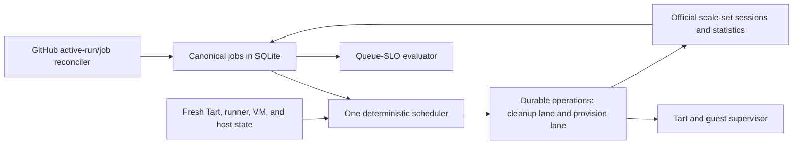

# Fleet architecture plan: reliable, work-conserving, low-latency CI

Status: reviewed target. ADR 0015 records the narrow supersessions, and the
accompanying change implements the Phase 1 inventory foundation: complete REST
snapshots, official scale-set statistics, monotonic canonical queue age,
conservative correlation, truthful queue health, and fail-closed readiness.
It lands behind `github.canonicalJobInventory`; production activation, the
remaining Phase 1 operator surfaces, and later phases remain gated by their
permissions, incident replays, truthful candidate configuration, and canaries.

Scope: one Apple Silicon Mac mini, Tart VMs, GitHub Actions runner scale sets

Primary objective: maximize completed CI work while keeping eligible runner queue
latency bounded and preserving jobs across controller failure or upgrade.

## 1. Decision summary

Retain the existing safety core:

- one `fleet` authority process;
- one local SQLite WAL database;
- the official GitHub Actions runner scale-set protocol;
- a pure deterministic scheduler;
- durable idempotent lifecycle operations;
- exact CPU, memory, disk, slot, repository, and profile limits;
- ephemeral runners and ownership-checked cleanup;
- guest VMs independent of controller restarts.

Make four architectural corrections:

1. Maintain one canonical GitHub workflow-job record across every scale-set
   delivery or retry. Queue age never resets.
2. Reconcile the complete GitHub job backlog in addition to consuming the
   scale-set stream. Scale-set capacity remains a truthful executable bound,
   not a queue-lookahead mechanism.
3. Replace FIFO-plus-cardinality scheduling with a small deterministic policy:
   safety, queue deadline, explicit critical class, repository fairness, then
   exact resource packing.
4. Reduce and measure non-preemptive macOS blocking by shortening long Maestro
   shards. A hard latency guarantee requires a second host; no scheduler can
   manufacture capacity on an occupied single host.

Do not introduce microservices, a distributed database, machine learning,
workflow-DAG inference, runner preemption, CPU overcommit, or a permanent warm
pool. None is required to resolve the recorded incidents.

## 2. Evidence and constraints

### 2.1 The production queue incident

Budgie PR 597's `Build iOS E2E app` was created at 09:47:52, but the first
durable builder request did not reach the fleet until 10:41:43. GitHub then
reissued the same logical work with new request identities. The scheduler saw a
newer queue time, admitted an older Maestro request, and could not run the
8-CPU builder until Maestro released the host. Once capacity existed, builder
provisioning took about 24 seconds.

The failure was therefore not VM cloning. It was:

- incomplete backlog visibility;
- transient demand identity and reset queue age;
- a repository-capacity mismatch that stranded capacity;
- strict non-preemptive ordering without an explicit critical class;
- a long Maestro job whose resource vector excludes Builder.

### 2.2 Measured service times

Production history shows that clone time is approximately 0.2--0.3 seconds.
Boot and guest readiness are tens of seconds, while long Maestro work can run
for more than an hour. Pre-cloning or a permanent idle VM would therefore spend
resources without addressing the dominant delay.

With the current default vectors:

| Profile | CPU | Memory | Important bound |
|---|---:|---:|---|
| Builder | 8 | 12 GiB | exclusive on an 8-CPU host |
| Maestro | 4 | 7 GiB | up to two when no incompatible work is reserved |
| Host | 8 | 16 GiB | four VMs maximum |

`Builder + Maestro` is infeasible. Because jobs are non-preemptive, the maximum
duration of a running Maestro shard is also the worst-case time a newly queued
Builder can be blocked. This is a capacity theorem, not a scheduler defect.

## 3. State-of-the-art review and selected techniques

Only techniques that solve a demonstrated failure are selected.

| Technique | Decision | Reason |
|---|---|---|
| Official runner scale-set statistics and messages | Use | GitHub states that retries can produce new messages for the same job and that `statistics.TotalAssignedJobs` is the scaling truth. |
| Periodic GitHub REST reconciliation | Use | Gives the queue-SLO monitor the complete managed-repository backlog when an individual scale-set request is hidden or delayed. |
| Ephemeral runners | Keep | GitHub recommends ephemeral runners for autoscaling and requires external diagnostic-log preservation. |
| Dominant Resource Fairness | Use a small weighted form | Fairly shares CPU, memory, and slots between repositories without duplicating static capacity in several caps. |
| Exact bounded bin packing | Keep and improve objective | At most four runners fit, so deterministic enumeration is simpler and more reliable than a heuristic scheduler. |
| Kubernetes-style requested-to-capacity scoring | Use as final packing tie-break | Reduces CPU/memory fragmentation after deadlines and fairness are satisfied. |
| Historical runtime prediction | Telemetry only initially | Useful later, but mutable prediction is unnecessary for the first correctness release and complicates replay. |
| Workflow DAG/HEFT scheduling | Do not implement now | Explicit critical scheduling classes solve the observed builder gate without workflow parsing or graph inference. |
| Webhook-only autoscaling | Reject | A local Mac should not depend on one externally delivered webhook for correctness. Polling reconciliation remains the repair path. |
| Inflated scale-set `maxCapacity` | Reject | It promises capacity the fleet cannot fulfill and still does not provide canonical GitHub job identity. |
| Delaying the second Maestro for a fixed window | Reject | One Maestro already blocks the 8-CPU Builder, so the delay sacrifices throughput without bounding Builder latency. |
| Preemption | Reject | Interrupting an owned CI job violates the reliability objective and wastes completed work. |
| Permanent warm VMs | Reject initially | The measured provisioning cost is small relative to queue-discovery and long-job blocking. |
| CPU/memory overcommit | Reject | Memory pressure and swap were recorded incident classes; exact envelopes remain hard limits. |
| PostgreSQL or microservices | Reject | One Mac is one failure domain. Extra services add failure and upgrade surfaces without adding capacity. |

Primary references:

- [Official Actions Runner Scale Set Client](https://github.com/actions/scaleset/blob/v0.4.0/README.md)
- [GitHub self-hosted runner routing and autoscaling](https://docs.github.com/en/actions/reference/runners/self-hosted-runners)
- [GitHub App installation tokens](https://docs.github.com/en/apps/creating-github-apps/authenticating-with-a-github-app/generating-an-installation-access-token-for-a-github-app)
- [Dominant Resource Fairness](https://people.eecs.berkeley.edu/~alig/papers/drf.pdf)
- [Kubernetes resource bin packing](https://kubernetes.io/docs/concepts/scheduling-eviction/resource-bin-packing/)
- [Google Borg](https://research.google/pubs/large-scale-cluster-management-at-google-with-borg/)
- [Google SRE: cascading failures](https://sre.google/sre-book/addressing-cascading-failures/)
- [SQLite WAL](https://sqlite.org/wal.html)
- [OpenTelemetry CI/CD semantic conventions](https://opentelemetry.io/docs/specs/semconv/cicd/)

## 4. Minimal target architecture



This remains one executable and one database. The boxes are in-process
components with explicit ports, not separately deployed services.

### 4.1 Canonical job inventory

The authoritative GitHub identity, when REST has observed it, is:

```text
(scope, repository, workflow_job_id, run_attempt)
```

The scale-set protocol does not provide the numeric REST workflow-job ID or run
attempt. It provides a protocol job UUID, workflow-run ID, display name, labels,
queue time and request ID. The database therefore uses an internal immutable
`job_key`; REST identity is nullable until correlation succeeds. A scale-set
request ID or protocol job UUID is always an alias, never the canonical key.

Target logical records (physical names may reuse the existing demand
projection during migration):

```text
jobs(
  job_key PRIMARY KEY,
  scope, repository, workflow_job_id NULL, run_attempt NULL,
  workflow_run_id, job_display_name, labels_fingerprint,
  profile, scheduling_class,
  github_status, scale_set_status,
  first_queued_at, last_observed_at, completed_at
)

request_aliases(
  scope, scale_set_id, runner_request_id, protocol_job_uuid,
  job_key,
  UNIQUE(scope, scale_set_id, runner_request_id)
)

UNIQUE(scope, repository, workflow_job_id, run_attempt)
  WHERE workflow_job_id IS NOT NULL
```

Rules:

- `first_queued_at` is the minimum trusted timestamp ever observed and cannot
  move forward.
- A new request ID for a correlated existing job creates an alias, not another
  demand.
- `run_attempt` comes from REST and is never hard-coded. It remains unknown on
  a protocol-only provisional record.
- Completed or cancelled GitHub state dominates an older available message.
- Scale-set messages are still committed before acknowledgement.
- Aggregate `TotalAssignedJobs` and `TotalRunningJobs` are persisted per scale
  set. A mismatch with canonical jobs is an explicit degraded observation.
- A REST-only queued job participates in SLO monitoring and reservations but
  cannot acquire JIT credentials or start a VM until the official scale-set
  protocol supplies executable demand.

Correlation is deterministic and conservative:

1. Match within the same scope, repository and workflow-run ID.
2. Require normalized display name, profile labels and labels fingerprint to
   agree.
3. When one unmatched REST job remains, attach the protocol aliases to it.
4. When several REST jobs are scheduling-equivalent, share only their minimum
   queue age and common attempt. Do not assign a numeric workflow-job ID until
   another field makes the match unique. Scheduling equivalence does not make
   guessed cleanup identity safe.
5. Never merge non-equivalent or uncertain candidates. Keep a provisional
   protocol job visible, raise source divergence, and never make more jobs
   executable than current official scale-set statistics allow.
6. A later unambiguous match transactionally repoints aliases, preserves the
   minimum queue timestamp and the most advanced lifecycle state, then removes
   the provisional projection.

Runner and VM lifecycle ownership remains keyed by the exact scale-set request
and runner identity, so REST correlation can improve scheduling and SLO truth
without weakening cleanup safety. The request acquired to provision a JIT
runner is a reservation, not proof that GitHub executed that request on the
same runner. When an official lifecycle event supplies `RunnerName`, the named
runner is authoritative. If GitHub cross-assigns two reservations, SQLite
atomically swaps their scheduling identities before advancing lifecycle state;
immutable Tart ownership signatures are never rewritten. Missing, duplicate,
or incompatible correlations fail closed.

At most one REST-only job may hold a host reservation. The scheduler chooses it
with the same ordering used for executable work. The reservation:

- is allowed only for a fresh runner-eligible job that is `critical` or has
  breached the 10-minute queue SLO;
- prevents admission of new, lower-ranked incompatible work;
- never drains or interrupts a busy runner;
- creates no VM, JIT registration, or external side effect;
- is cleared when official executable demand arrives or fresh GitHub state
  becomes terminal;
- is valid only while its GitHub job observation is fresh. A stale scope keeps
  its durable age and becomes degraded, but its non-executable reservation is
  released so it cannot strand every other healthy scope.

This is capacity protection derived from current job state, not a prediction or
fixed discovery timer.

### 4.2 Complete backlog reconciliation

For each managed repository, periodically:

1. list queued and in-progress workflow runs;
2. fetch jobs only for new or changed active runs;
3. retain ETags and the last observed state;
4. normalize labels case-insensitively;
5. classify workflow-level concurrency waits separately from jobs waiting for
   a runner;
6. reconcile terminal jobs until associated runner and VM cleanup completes.

Default interval: 30 seconds with jitter. During a queue-SLO breach, poll the
affected repository every 15 seconds. Back off on GitHub rate-limit evidence;
never translate an API error into an empty queue.

The official workflow-job REST representation exposes `started_at`, not a
documented job `created_at`. Queue-age ingestion therefore prefers a supplied
job creation timestamp, then `started_at`, and finally the workflow-run creation
time as a conservative bound. It must never reject the complete snapshot merely
because an undocumented job field is absent. Workflow-concurrency classification
in the remaining Phase 1 work removes the conservative bound from runner-wait
metrics when the job was not yet runner-eligible.

No publicly reachable webhook endpoint is required. A webhook may later reduce
latency, but periodic reconciliation remains authoritative for repair.

This supersedes ADR 0002 only where that ADR limits REST to compatibility use
and assumes scale-set messages provide a complete scheduling backlog. ADR
0002's official protocol, commit-before-ack, durable cursor, pagination,
fail-closed errors, adapter isolation, and secret handling remain unchanged.

### 4.3 Truthful scale-set capacity

`maxCapacity` equals the maximum number of runners that the scale set can
actually execute under its profile, repository, and host constraints. It must
not be increased merely to expose a hidden successor.

The fleet records official scale-set statistics and alerts when:

```text
TotalAssignedJobs != canonical assigned-or-waiting scale-set jobs
```

after a bounded reconciliation window. This detects delivery/session gaps
without claiming unusable capacity.

This decision supersedes the queue-lookahead clause in ADR 0009 and the current
`maxCapacity > runtimeCapacity` validation proposal. ADR 0009's session
recovery, durable cursor, source replacement, and fail-closed behavior remain.

### 4.4 Scheduler policy

Hard constraints are evaluated first:

- fresh and usable observations for the affected scope;
- exact CPU, memory and VM-slot availability;
- host-pressure admission;
- repository and profile safety ceilings;
- runner/VM ownership and lifecycle state;
- label/profile compatibility.

Among feasible queued jobs, use this deterministic order:

1. Jobs past the 10-minute queue SLO, oldest first.
2. Young `control-plane` jobs, then young `critical` jobs, then young
   `standard` jobs.
3. Weighted repository fairness within a class.
4. Exact subset selection maximizing admitted jobs, then used CPU and memory,
   then minimizing residual fragmentation.
5. Stable tie-break by `first_queued_at` and canonical key.

The `critical` class is explicit configuration matched by repository,
workflow, job-name pattern, and required profile. It is intended for a small
set of gates such as `Build iOS E2E app`. Unknown jobs default to `standard`.
Invalid or overlapping rules fail configuration validation.

The 10-minute SLO remains an absolute starvation guard: critical work cannot
overtake a job that has already breached it. If this rule causes an unavoidable
Builder wait, the solution is shorter blocking jobs or more capacity, not
unbounded priority.

Weighted Dominant Resource Fairness replaces duplicated soft repository caps.
Repository `maxActive` remains only as a hard blast-radius limit. Unused share
is borrowable; no repository reserves idle CPU merely because it has a larger
configured cap.

Because the candidate horizon and host width are small, cap the ordered
candidate horizon at 32 and enumerate subsets of at most four jobs exactly.
This fixed bound is deterministic and requires no wall-clock cutoff or general
integer-programming dependency.

### 4.5 macOS profile changes and blocking bound

Keep these rules:

- never preempt a running job;
- reuse a compatible idle runner;
- never drain a busy runner merely to change profiles;
- drain incompatible idle runners only with fresh GitHub and Tart evidence;
- admit Linux beside Maestro whenever exact vectors fit;
- Builder remains exclusive under the current 8-CPU vector.

Remove the fixed five-minute second-Maestro hold. It does not protect Builder
from the first Maestro and introduces intentional idle time.

Instead, establish an application-level Maestro shard service objective:

- initial target: p95 below 10 minutes;
- hard operational alert at 15 minutes;
- partition tests using recorded per-test duration and longest-processing-time
  first assignment;
- recompute partitions from successful history outside the fleet authority;
- fall back to the checked-in static partition if history is missing.

The fleet stores job-duration telemetry but does not use learned duration as a
hard safety input in the first implementation.

Sharding creates a statistical service-time bound, not a hard one: tests and
infrastructure can still run unusually slowly. If measured arrival rate and
shard duration make the queue SLO unattainable, or if a hard maximum is
required, add a second Mac mini or a bounded external burst route. This is the
only reliable solution when simultaneous demand exceeds one host's capacity.

### 4.6 Operation isolation without microservices

Keep one durable operations table and the existing idempotent effects. Add a
small integer priority and two independent worker semaphores:

1. cleanup/reclaim/session-recovery lane;
2. provisioning lane.

Cleanup must not wait behind a batch of provisions, and a slow GitHub session
recovery must not hold the Tart mutation semaphore. Tart host mutations remain
serialized where the backend requires it.

Retry policy:

- bounded attempts for provisioning that has produced no external effect;
- indefinite, visible, capped-backoff retries for owned cleanup;
- exponential backoff with full jitter per dependency and scope;
- one retry budget at the operation layer, not stacked retries in every port;
- a failed scale-set session degrades only its scope/profile;
- uncertain host inventory blocks new host mutations globally but does not
  interrupt running jobs.

### 4.7 Release and configuration simplification

Replace the generation-specific self-updating updater entrypoint with one small,
stable launcher installed once and referenced permanently by launchd.

The stable launcher:

- reads `installed-generation.json`;
- verifies owner, mode, canonical paths, manifest and hashes;
- executes the exact generation's `fleet` or update command;
- contains no scheduler, GitHub, Tart, or migration policy.

An update stages one immutable generation containing:

```text
binaries + normalized fleet configuration + policy hash + schema version +
guest-helper version + checksums
```

Activation atomically changes the installed-generation manifest. The stable
launcher then starts the selected generation. The updater never unloads or
replaces its own launchd program, eliminating the self-handoff state machine.
Updating the stable launcher itself is rare and manual.

Running VMs are not a reason to defer an update: ADR 0008 already makes them
independent of controller restarts. Activation waits only for no ambiguous
uncommitted host mutation and requires database compatibility with the previous
generation. The durable operation worker resumes after restart.

Every schema change must be readable by N and N-1 until the new generation has
passed readiness. Failure restores the previous manifest and restarts N-1.

Emergency policy overrides are separate, audited records with reason and
expiration. Silent edits to the active generation's `fleet.json` are invalid.

This design retains checksum, canary, rollback, readiness and immutable-release
controls while deleting the repeated updater reload/self-bootout/handoff
failure surface.

It supersedes ADR 0011's requirements to wait for an empty fleet and to reload
a generation-specific updater through a handoff job. ADR 0011's trusted-release
selection, checksums, archive validation, atomic commit, forward-only updates,
readiness proof and rollback remain unchanged.

### 4.8 SQLite lifecycle

SQLite remains the authority. Add only the indexes needed by the canonical job
inventory and operation priority:

```text
jobs(github_status, profile, first_queued_at)
jobs(repository, workflow_run_id)
operations(state, priority, next_attempt_at)
instances(state, profile)
```

Retention:

- keep active projections permanently;
- retain raw message inbox and detailed transitions for 30 days;
- retain compact idempotency/effect tombstones for at least one year;
- take a daily online backup;
- expose WAL size and checkpoint duration;
- run `PRAGMA optimize` periodically;
- never run blocking full `VACUUM` during active CI.

Do not add a remote database until the fleet has multiple physical hosts.

## 5. SLOs and observability

Fleet readiness is necessary but insufficient. Queue SLO is part of production
health.

Record these timestamps for each canonical job:

```text
GitHub created
first REST observation
first scale-set delivery
scheduler admission
provision start
VM ready
runner registered
GitHub job started
job completed
runner absent
VM deleted
```

Derived stages:

- workflow concurrency wait;
- GitHub discovery delay;
- scale-set delivery delay;
- scheduler wait;
- provision delay;
- GitHub dispatch delay;
- execution time;
- cleanup time.

Initial objectives:

| Signal | Objective |
|---|---:|
| Eligible fleet-owned job start | p95 < 2 minutes, p99 < 10 minutes |
| Critical Builder start | p99 < 5 minutes when no job was already consuming its exclusive vector |
| Any runner-eligible queue | 30 minutes is an incident |
| GitHub backlog discovery | p99 < 60 seconds |
| Scheduler decision | p99 < 100 milliseconds |
| Provisioning | p95 < 75 seconds |
| Cleanup/reclaim | p99 < 60 seconds after authoritative completion |
| Idle compatible resources while executable backlog exists | < 1% outside fresh higher-ranked reservations and safety blocks |
| Unexpected retry/dead operations | zero |
| Unowned/orphan VMs | zero |

Prometheus labels remain bounded to scope, profile, stage and result. Job, run,
runner and VM IDs belong in structured logs and traces, not metric labels.
Forward ephemeral runner diagnostics before deleting the VM.

## 6. Historical failure reconciliation

The plan does not replace controls that already work. It identifies the
minimal enduring control for every recorded failure class.

| Recorded failure class | Enduring control | Plan impact |
|---|---|---|
| Polling wake latency and jobs hidden behind scale-set capacity | Official statistics plus complete REST reconciliation and queue-SLO health | Replace inflated-capacity lookahead |
| Admin endpoint mismatch | Installed-generation manifest owns the canonical socket; launcher verifies it | Retain |
| launchd/updater missing PATH | Stable launcher uses absolute paths and verified generation contents | Simplify |
| Control-plane work starved by application work | Bounded `control-plane` class below breached-SLO work | Retain |
| Large or incompatible head blocked fitting jobs | Exact feasible-subset selection | Retain |
| Linux capacity stranded during macOS activity | Shared exact CPU/memory/slot envelope | Retain |
| Unbounded backfill postponed macOS handoff | One-shot durable backfill only where still needed | Retain; remove if scheduler-v2 replay proves redundant |
| Label casing mismatch | Canonical case-insensitive label normalization at ingestion | Retain |
| Shadow replay plan conflicts | Idempotent plan generation/effect keys | Retain |
| Preassigned job with zero request ID | Canonical workflow-job identity; request IDs are optional aliases | Strengthen |
| Job-bound runner drained during handoff | Fresh assignment state forbids busy drain | Retain |
| Ghost JIT registration | Observe/reset exact registration before retry; never persist JIT secret | Retain |
| Missing PATH, CocoaPods, UTF-8 locale or Android SDK | Versioned guest-helper contract and canary per platform | Retain |
| Ephemeral deregistration exhausted retry budget | Cleanup lane retries indefinitely with visible capped backoff | Retain |
| CPU/memory or guest-disk drift | Exact resource reconciliation and per-profile disk floor | Retain |
| Replacement assignment or cancelled request leaked runner/VM | Canonical job/alias state plus runner absence and durable cleanup | Strengthen |
| Release/checksum/bootstrap mismatch | Immutable generation manifest and verified stable launcher | Simplify |
| Stopped teardown counted as capacity | Fresh VM power plus lifecycle state defines resource consumption | Retain |
| Controller restart killed active Tart VM | Independent guest process/session and durable reattachment | Retain |
| Failed pre-registration leaked capacity | Restartable provision state machine and effect reconciliation | Retain |
| Host pressure caused unsafe admission | Exact pressure guard; no overcommit | Retain |
| Guest listener exited but VM stayed running | Version-matched guest supervisor powers off; controller reclaims | Retain |
| Recurrent scheduler generation conflict | Generation-fenced durable plan | Retain |
| Mixed Linux/macOS underutilization | Work-conserving shared resource vectors | Retain |
| Repository `maxActive` drift stranded capacity | Hard caps generated from one normalized policy; DRF handles soft fairness | Replace duplicated manual values |
| Failed/stale scale-set session required daemon restart | Per-source atomic session replacement and scoped degradation | Retain |
| Session shutdown/cleanup exceeded launchd budget | Bounded close; stable launcher and durable resume | Simplify |
| Updater rollback/bootstrap/readiness races | Stable launcher plus atomic manifest switch and N/N-1 rollback | Replace handoff complexity |
| Updater loaded an older executable than installed generation | Launchd always targets stable launcher; launcher verifies manifest on every exec | Replace handoff complexity |
| Mutable production config diverged from installed binary | Configuration and policy hash are part of the immutable generation | New control |
| GitHub retries reset queue age | Canonical workflow-job key and monotonic `first_queued_at` | New control |
| Long Maestro blocked critical Builder | Explicit critical class plus bounded Maestro shard duration | New control |

## 7. Implementation sequence

Each phase is independently releasable and must begin with a failing production
incident replay.

### Phase 0: correct the architectural contract

1. Add one ADR recording the narrow supersessions of ADR 0002 backlog
   discovery, ADR 0009 delivery lookahead, and ADR 0011 updater activation.
2. Rework the queue-lookahead branch; do not deploy its
   `maxCapacity > runtimeCapacity` requirement.
3. Do not change the running production capacity until Phase 1's complete
   backlog observer has passed canary and shadow comparison.
4. Do not adopt the fixed-delay adaptive Maestro proposal.

Exit criteria:

- official scale-set contract tests pass;
- existing authority, lifecycle and session-recovery tests remain green;
- the target contract cannot promise more runners than a profile can execute;
- production behavior is unchanged until replacement visibility exists.

### Phase 1: canonical jobs and complete queue health

Implementation boundary of the accompanying change: steps 1--4 are complete
except ETag/change caching, step 5 is complete for health/readiness metrics,
and terminal runner/VM correlation uses authoritative runner-name assignment.
Source-divergence rendering in `fleet`, workflow-concurrency classification,
REST-only reservations, and the production capacity change remain follow-up
work. REST reconciliation currently performs a bounded full active-run
snapshot; caching is a performance optimization, not a correctness dependency.

1. Add one canonical demand-group record and retain the existing per-request
   demand projection as its alias/lifecycle table. Keep the replaceable REST
   job snapshot as observation cache, not a second authority.
2. Preserve workflow-job ID and run attempt from REST, and preserve all
   protocol correlation fields without inventing either value.
3. Add cached active-run/job REST reconciliation.
4. Persist scale-set aggregate statistics.
5. Expose source divergence and end-to-end queue age in `fleet`.
6. After canary and shadow prove complete visibility, remove inflated capacity
   and set each production scale set to its truthful executable maximum.

REST-to-profile routing must use GitHub's actual scale-set compatibility rule:
every requested job label is present in the effective scale-set label set. The
effective set includes configured aliases and the automatically advertised
scale-set name. A self-hosted job that matches no scale set or more than one
scale set is uncertain, not invisible or duplicated. Replacing a scope's
per-profile REST cache is one transaction so a persistence failure retains the
complete previous snapshot.

Mandatory replays:

- one GitHub job delivered under three request IDs retains one record and its
  original queue time;
- two same-name matrix jobs share canonical age but never receive a guessed
  numeric identity, and official statistics still bound executable work;
- a protocol-only job remains executable but visibly provisional when REST is
  unavailable;
- a queued REST job missing from durable scale-set demand becomes degraded
  after the delivery window;
- an API error never clears the queue;
- workflow-concurrency waiting is not reported as runner waiting;
- alias-only and scale-set-name jobs map to exactly one profile, while
  unmatched or ambiguous self-hosted jobs fail closed;
- an injected write failure while replacing any profile retains the previous
  REST snapshot for every profile in the scope;
- terminal reconciliation cannot delete a busy or ambiguously owned runner.

### Phase 2: scheduler v2

1. Add the explicit `critical` class and strict config validation.
2. Implement weighted repository DRF.
3. Change exact selection's objective to deadline, class, fairness, cardinality,
   utilization, fragmentation, stable key.
4. Retain all safety and no-preemption invariants.

Mandatory replays:

- a visible critical Builder is admitted before young Maestro;
- a job older than 10 minutes remains ahead of a new critical job;
- no repository monopolizes all share while another has feasible work;
- mixed Linux/Maestro packing remains work-conserving;
- an oversized head cannot block fitting work;
- scheduler output is deterministic under input permutation and restart.

### Phase 3: bound macOS service time

1. Measure test-level Maestro durations.
2. Produce checked-in duration-balanced shards.
3. Alert on shards above 15 minutes.
4. Remove the fixed second-Maestro delay.
5. Re-evaluate the 10-minute queue SLO under peak production load.

Exit criteria:

- Maestro p95 shard duration is below 10 minutes;
- p99 Builder wait caused by an already-running Maestro is below 15 minutes;
- total Maestro wall-clock completion does not regress materially;
- if the bound cannot be met, approve a second-host/burst-capacity plan rather
  than adding another scheduler heuristic.

### Phase 4: isolate operations and simplify updates

1. Add cleanup and provision worker lanes.
2. Verify scope-local session failure cannot stop healthy scopes.
3. Introduce the stable launcher and immutable config/policy bundle.
4. Migrate updater activation to the atomic installed-generation manifest.
5. Delete updater self-handoff only after rollback and reboot proofs pass.

Mandatory replays:

- cleanup is not starved by provision operations;
- restart during active jobs preserves jobs and resumes operations;
- failed candidate readiness restores N-1;
- reboot starts the manifest-selected generation and exact configuration;
- stale plist or executable state cannot create a second authority;
- historical terminal dead letters do not block updates, while unresolved
  ambiguous external effects do.

### Phase 5: retention and stage telemetry

1. Add stage timestamps and bounded histograms.
2. Forward runner/guest logs.
3. Add inbox/transition retention and daily online backup.
4. Add WAL/checkpoint and idle-with-backlog alerts.

Exit criteria:

- every queue incident identifies its dominant stage without opening SQLite;
- 30-day retention remains bounded;
- backup restore succeeds in a scheduled disaster-recovery test.

## 8. Complexity budget and deletion targets

The implementation is accepted only if it stays within this budget:

- one daemon and one stable launcher;
- one SQLite database;
- one scheduler implementation;
- two lifecycle worker lanes;
- one canonical job table and one alias table;
- three scheduling classes;
- no distributed coordination;
- no learned model in authority decisions;
- no public webhook requirement;
- no profile-name special case except validated resource/profile compatibility;
- no timer heuristic presented as a capacity guarantee.

Delete or supersede:

- scale-set queue-lookahead capacity inflation;
- `maxCapacity > runtimeCapacity` validation;
- fixed second-Maestro discovery delay;
- generation-specific updater self-reload and handoff after stable-launcher
  migration;
- duplicated soft repository-cap values once weighted DRF is authoritative.

Retain only incident replays that express an enduring invariant. Replace tests
of removed implementation mechanics with tests of the corresponding outcome.

## 9. Acceptance definition

The architecture is complete when all of the following are simultaneously
true under representative peak load:

- every managed GitHub runner-eligible job has one canonical durable record;
- original queue age survives scale-set retries and controller restarts;
- no compatible capacity is idle while executable work exists unless a fresh
  higher-ranked reservation or a safety constraint explains it;
- no repository can permanently monopolize CPU, memory or slots;
- p99 macOS blocking remains within the declared service objective; a hard
  bound is claimed only after adding independent compatible capacity;
- controller restart and update do not interrupt running jobs;
- runner and VM cleanup converges without destructive guesses;
- queue SLO, source divergence, host pressure and updater generation are visible
  through `fleet`;
- production configuration, policy and executable form one verified immutable
  generation;
- all historical incident replays pass under the simplified design.

This delivers maximum *useful* utilization: completed CI work per host-hour,
not merely maximum VM occupancy. It also states the unavoidable limit plainly:
when offered work exceeds one Mac mini's non-preemptive capacity, reliability
requires shorter jobs or another host, not more control-plane complexity.
